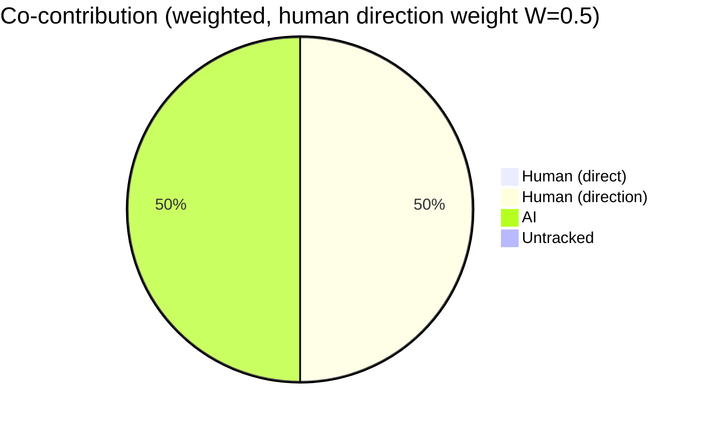
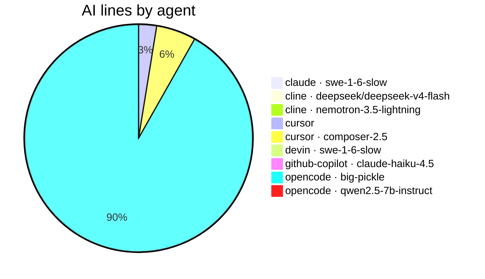

# AI Authorship Report

This file shows which AI coding agent (or human) wrote the code in each commit,
using the [git-ai](https://usegitai.com) attribution notes attached to every
commit. It is regenerated automatically by a GitHub Actions workflow on every
push to `main`.

## Summary

- Commits analyzed: **50** (last 50)
- Total lines added: **3040**
- **AI-generated:** 760 lines (25.0%)
- **Human:** 1 lines (0.0%)
- **Bot:** 2278 lines (74.9%)
- **Untracked:** 1 lines (0.0%)
- **Human-directed AI:** 760 lines (100.0% of AI; direction weight 0.5)
- **Co-authored commits (human + AI lines):** 0
- **Agents:** claude · swe-1-6-slow (1 lines), cline · deepseek/deepseek-v4-flash (1 lines), cline · nemotron-3.5-lightning (1 lines), cursor (19 lines), cursor · composer-2.5 (42 lines), devin · swe-1-6-slow (1 lines), github-copilot · claude-haiku-4.5 (7 lines), opencode · big-pickle (685 lines), opencode · qwen2.5-7b-instruct (3 lines)

## Composition





> **Legend:** `opencode · big-pickle` = agent and the LLM model that generated
> the lines (model is recorded when git-ai can resolve it from the agent's
> session data). `bot` = committed by an automated account (`github-actions[bot]`
> and other `[bot]` accounts, e.g. the workflow regenerating this report) — known
> authorship, not attributed through git-ai. `untracked` = lines with no
> attribution data — written before git-ai was set up or made in the github.com
> web UI (cannot be retroactively attributed). `human` = written directly by a
> human and recorded via `git-ai checkpoint human` or the git-ai extension.
> `Human (direct)` = human-written lines; `Human (direction)` = the credited
> share of AI lines from sessions whose human driver git-ai recorded (weight
> `W` = `REPORT_HUMAN_DIRECTION_WEIGHT`, default 0.5); `AI` = the AI lines not
> credited to the human (including autonomous AI with no recorded driver). A
> `✓` in the per-commit table marks a co-authored commit (contains both
> human-written and AI lines). These are line-count percentages, not commit
> counts. The composition pie excludes the report's own `bot` commits by
> default; set `REPORT_SHOW_BOT_CHART=1` to include them, or
> `REPORT_SHOW_DIRECTION=0` for a strict AI/Human/Untracked line-count pie.

## Per-commit breakdown

| Commit | Date | Message | Lines | AI | Human | Co | Agent(s) |
| --- | --- | --- | --- | --- | --- | --- | --- |
| 4a2cd6e | 2026-08-16 | sync: weighted co-contribution view (human-direction credit) + co-authored marker from ai-authorship | 125 | 100% | 0% |  | opencode · big-pickle |
| cdfa377 | 2026-08-16 | docs: regenerate AI authorship report | 112 | 0% | 0% |  | bot |
| d8fcf12 | 2026-08-16 | sync: fix copy-in workflow to commit AI-AUTHORSHIP.json alongside the .md | 5 | 100% | 0% |  | opencode · big-pickle |
| 54f5cf4 | 2026-08-16 | docs: regenerate AI authorship report | 41 | 0% | 0% |  | bot |
| b865bf1 | 2026-08-16 | chore: regenerate report — initial commit rolled out of 50-commit window | 83 | 100% | 0% |  | opencode · big-pickle |
| 6a89530 | 2026-08-16 | docs: regenerate AI authorship report | 56 | 0% | 0% |  | bot |
| 1a607b4 | 2026-08-16 | sync: update authorship report script + workflow from ai-authorship | 8 | 100% | 0% |  | opencode · big-pickle |
| 6033a7c | 2026-08-16 | docs: regenerate AI authorship report | 103 | 0% | 0% |  | bot |
| e2fa8ce | 2026-08-16 | sync: update authorship report script + workflow from ai-authorship | 34 | 100% | 0% |  | opencode · big-pickle |
| ee29603 | 2026-08-16 | docs: regenerate AI authorship report | 193 | 0% | 0% |  | bot |
| f37f6ab | 2026-08-16 | sync: update authorship report script + workflow from ai-authorship | 37 | 100% | 0% |  | opencode · big-pickle |
| 4bc8085 | 2026-08-16 | docs: regenerate AI authorship report | 108 | 0% | 0% |  | bot |
| 9a23637 | 2026-08-16 | feat: add per-agent breakdown pie chart to report composition | 12 | 100% | 0% |  | opencode · big-pickle |
| 9243d1b | 2026-08-16 | docs: regenerate AI authorship report | 757 | 0% | 0% |  | bot |
| 3cd6dab | 2026-08-16 | feat: emit machine-readable AI-AUTHORSHIP.json + composition pie chart | 89 | 100% | 0% |  | opencode · big-pickle |
| 243887d | 2026-08-16 | docs: regenerate AI authorship report | 52 | 0% | 0% |  | bot |
| e7a7c91 | 2026-08-15 | docs: note local-model (LM Studio qwen2.5-7b-instruct) proof on this repo | 2 | 100% | 0% |  | opencode · big-pickle |
| 2c9790a | 2026-08-15 | docs: regenerate AI authorship report | 52 | 0% | 0% |  | bot |
| 7b79bd1 | 2026-08-15 | Created by LM Stuido with opencode | 3 | 100% | 0% |  | opencode · qwen2.5-7b-instruct |
| b79a733 | 2026-08-15 | docs: regenerate AI authorship report | 52 | 0% | 0% |  | bot |
| d8ae5d6 | 2026-08-14 | docs: add live website link (needpc.net/life) | 2 | 100% | 0% |  | opencode · big-pickle |
| d61a459 | 2026-08-15 | docs: regenerate AI authorship report | 59 | 0% | 0% |  | bot |
| 3a4581d | 2026-08-14 | docs: tidy separator before license section | 0 | 0% | 0% |  | none |
| 293f451 | 2026-08-14 | docs: remove needpc.net line | 0 | 0% | 0% |  | none |
| 8cba1ef | 2026-08-15 | docs: regenerate AI authorship report | 47 | 0% | 0% |  | bot |
| b7e37f0 | 2026-08-14 | docs: manually shorten needpc.net line (human-attributed edit) | 1 | 0% | 100% |  | human |
| 7195ad1 | 2026-08-15 | docs: regenerate AI authorship report | 52 | 0% | 0% |  | bot |
| ca7ee4b | 2026-08-14 | docs: add TeamWork mention via Devin Desktop live test | 1 | 100% | 0% |  | devin · swe-1-6-slow |
| 9973fde | 2026-08-14 | docs: regenerate AI authorship report | 68 | 0% | 0% |  | bot |
| 150f8a4 | 2026-08-13 | feat: attribute Devin Desktop edits via .devin hooks to git-ai | 25 | 100% | 0% |  | claude · swe-1-6-slow, opencode · big-pickle |
| b0231be | 2026-08-14 | docs: regenerate AI authorship report | 52 | 0% | 0% |  | bot |
| 605ebd8 | 2026-08-13 | docs: add needpc line to README | 1 | 100% | 0% |  | cline · deepseek/deepseek-v4-flash |
| a0a233c | 2026-08-14 | docs: regenerate AI authorship report | 39 | 0% | 0% |  | bot |
| 09df4eb | 2026-08-13 | Remove divider rule pattern gallery | 0 | 0% | 0% |  | none |
| 45b21c8 | 2026-08-14 | docs: regenerate AI authorship report | 52 | 0% | 0% |  | bot |
| fc81dca | 2026-08-13 | Center pattern table in README | 1 | 100% | 0% |  | cline · nemotron-3.5-lightning |
| f15318b | 2026-08-13 | docs: regenerate AI authorship report | 63 | 0% | 0% |  | bot |
| e918bdb | 2026-08-13 | docs: replace glider with Conway pattern gallery (glider, blinker, toad, block, LWSS) | 43 | 100% | 0% |  | cursor · composer-2.5, opencode · big-pickle |
| c3c2f3b | 2026-08-13 | docs: regenerate AI authorship report | 57 | 0% | 0% |  | bot |
| 84fc816 | 2026-08-13 | docs: add glider art and expand dedication | 19 | 100% | 0% |  | cursor |
| 417601a | 2026-08-13 | docs: regenerate AI authorship report | 108 | 0% | 0% |  | bot |
| d32a64f | 2026-08-12 | fix: show brand title on mobile and contain active button glow in panels | 26 | 100% | 0% |  | opencode · big-pickle |
| 00864a3 | 2026-08-12 | feat: add undo/redo history for drawing, stamps, clear, randomize, and step | 197 | 100% | 0% |  | opencode · big-pickle |
| 372c70f | 2026-08-13 | docs: regenerate AI authorship report | 56 | 0% | 0% |  | bot |
| 3d0b9a8 | 2026-08-12 | fix: improve mobile touch gestures (proportional pinch zoom, two-finger pan) | 40 | 100% | 0% |  | opencode · big-pickle |
| 6139bdc | 2026-08-12 | docs: regenerate AI authorship report | 33 | 0% | 0% |  | bot |
| 460a12e | 2026-08-12 | Fix formatting in README.md section headers | 1 | 0% | 0% |  | untracked |
| a486b28 | 2026-08-12 | docs: regenerate AI authorship report | 66 | 0% | 0% |  | bot |
| 0e31e40 | 2026-08-12 | Merge branch 'main' of https://github.com/CaliMark/game-of-life | 0 | 0% | 0% |  | none |
| c8156e6 | 2026-08-12 | Update README: correct father's DOB to 1947, move AI Authorship note below Features, use info icon | 7 | 100% | 0% |  | github-copilot · claude-haiku-4.5 |

## Raw git-ai log (last 25 commits)

<details>
<summary>Show raw attribution detail</summary>

```text
commit 4a2cd6e3fced29e1899d87761d445fd225308691 (HEAD -> main, origin/main)
Author: CaliMark <mreed@needpc.net>
Date:   2026-08-16T13:47:31-07:00

    sync: weighted co-contribution view (human-direction credit) + co-authored marker from ai-authorship

    Git AI stats:
      you  ░░░░░░░░░░░░░░░░░░░░░░░░░░░░░░░░░░░░░░░░ ai
           0%                                  100%

    Authorship note:
      .github/workflows/authorship-report.yml
        s_988aa8c761b089::t_fb37ea4c2df588 32-36
      scripts/authorship-report.sh
        s_988aa8c761b089::t_4e293999ba2885 38-41,43,45,49,58,67-79,81,105-146,167-175,237-238,240-242,245,255-257,269-285,317-318,334-343,347-348,371,385-390
      ---
      {
        "schema_version": "authorship/3.0.0",
        "git_ai_version": "1.6.22",
        "base_commit_sha": "4a2cd6e3fced29e1899d87761d445fd225308691",
        "prompts": {},
        "sessions": {
          "s_988aa8c761b089": {
            "agent_id": {
              "tool": "opencode",
              "id": "ses_00bd75ff9ffesJ1tSH9l7XQdiY",
              "model": "big-pickle"
            },
            "human_author": "CaliMark <mreed@needpc.net>"
          }
        }
      }

commit cdfa377c800722f79e18b8e21560eb5e5195e407
Author: github-actions[bot] <41898282+github-actions[bot]@users.noreply.github.com>
Date:   2026-08-16T20:00:15Z

    docs: regenerate AI authorship report

    Git AI stats:
      you  ········································ ai
           0%           untracked 100%            0%

    Authorship note:
      (none)

commit d8fcf128f16ea9cb5778792ca0a8ae9f0801f452
Author: CaliMark <mreed@needpc.net>
Date:   2026-08-16T12:59:46-07:00

    sync: fix copy-in workflow to commit AI-AUTHORSHIP.json alongside the .md

    Git AI stats:
      you  ░░░░░░░░░░░░░░░░░░░░░░░░░░░░░░░░░░░░░░░░ ai
           0%                                  100%

    Authorship note:
      .github/workflows/authorship-report.yml
        s_988aa8c761b089::t_1863205ea494a2 60,69-70,72,77
      ---
      {
        "schema_version": "authorship/3.0.0",
        "git_ai_version": "1.6.22",
        "base_commit_sha": "d8fcf128f16ea9cb5778792ca0a8ae9f0801f452",
        "prompts": {},
        "sessions": {
          "s_988aa8c761b089": {
            "agent_id": {
              "tool": "opencode",
              "id": "ses_00bd75ff9ffesJ1tSH9l7XQdiY",
              "model": "big-pickle"
            },
            "human_author": "CaliMark <mreed@needpc.net>"
          }
        }
      }

commit 54f5cf4db37cded72f028cf8c8345ac056820517
Author: github-actions[bot] <41898282+github-actions[bot]@users.noreply.github.com>
Date:   2026-08-16T19:53:17Z

    docs: regenerate AI authorship report

    Git AI stats:
      you  ········································ ai
           0%           untracked 100%            0%

    Authorship note:
      (none)

commit b865bf19b178d824d33f65d7103efa9f28273d91
Author: CaliMark <mreed@needpc.net>
Date:   2026-08-16T12:52:50-07:00

    chore: regenerate report — initial commit rolled out of 50-commit window

    Git AI stats:
      you  ░░░░░░░░░░░░░░░░░░░░░░░░░░░░░░░░░░░░░░░░ ai
           0%                                  100%

    Authorship note:
      AI-AUTHORSHIP.md
        s_52d0732141ad88::t_90c2214b181fbe 11-12,14-16,22,24,37,57,114-127
      AI-AUTHORSHIP.json
        s_52d0732141ad88::t_90c2214b181fbe 3,5,7-9,12-15,25,30-79
      ---
      {
        "schema_version": "authorship/3.0.0",
        "git_ai_version": "1.6.22",
        "base_commit_sha": "b865bf19b178d824d33f65d7103efa9f28273d91",
        "prompts": {},
        "sessions": {
          "s_52d0732141ad88": {
            "agent_id": {
              "tool": "opencode",
              "id": "ses_008f7fcbaffeQRUMaWQo3qCxm4",
              "model": "big-pickle"
            },
            "human_author": "CaliMark <mreed@needpc.net>"
          }
        }
      }

commit 6a8953043ba91a1fadf94de3806855f79da05e1d
Author: github-actions[bot] <41898282+github-actions[bot]@users.noreply.github.com>
Date:   2026-08-16T19:44:47Z

    docs: regenerate AI authorship report

    Git AI stats:
      you  ········································ ai
           0%           untracked 100%            0%

    Authorship note:
      (none)

commit 1a607b4b6ace18998b5538cbf5d00823e5fec73f
Author: CaliMark <mreed@needpc.net>
Date:   2026-08-16T12:44:18-07:00

    sync: update authorship report script + workflow from ai-authorship

    Git AI stats:
      you  ░░░░░░░░░░░░░░░░░░░░░░░░░░░░░░░░░░░░░░░░ ai
           0%                                  100%

    Authorship note:
      .github/workflows/authorship-report.yml
        s_988aa8c761b089::t_6212bb4e2c97fd 29-31,60,69-70,72,77
      ---
      {
        "schema_version": "authorship/3.0.0",
        "git_ai_version": "1.6.22",
        "base_commit_sha": "1a607b4b6ace18998b5538cbf5d00823e5fec73f",
        "prompts": {},
        "sessions": {
          "s_988aa8c761b089": {
            "agent_id": {
              "tool": "opencode",
              "id": "ses_00bd75ff9ffesJ1tSH9l7XQdiY",
              "model": "big-pickle"
            },
            "human_author": "CaliMark <mreed@needpc.net>"
          }
        }
      }

commit 6033a7cd278a26bba8d7898abbe65c716baa9b77
Author: github-actions[bot] <41898282+github-actions[bot]@users.noreply.github.com>
Date:   2026-08-16T19:43:20Z

    docs: regenerate AI authorship report

    Git AI stats:
      you  ········································ ai
           0%           untracked 100%            0%

    Authorship note:
      (none)

commit e2fa8ce32781d05eb67ce7dcef9616eea1107c5e
Author: CaliMark <mreed@needpc.net>
Date:   2026-08-16T12:42:50-07:00

    sync: update authorship report script + workflow from ai-authorship

    Git AI stats:
      you  ░░░░░░░░░░░░░░░░░░░░░░░░░░░░░░░░░░░░░░░░ ai
           0%                                  100%

    Authorship note:
      .github/workflows/authorship-report.yml
        s_988aa8c761b089::t_d2f82b7d8a9590 29-32
      scripts/authorship-report.sh
        s_988aa8c761b089::t_61a4f010ab821c 44,54-60,193-210,230,242-244
      ---
      {
        "schema_version": "authorship/3.0.0",
        "git_ai_version": "1.6.22",
        "base_commit_sha": "e2fa8ce32781d05eb67ce7dcef9616eea1107c5e",
        "prompts": {},
        "sessions": {
          "s_988aa8c761b089": {
            "agent_id": {
              "tool": "opencode",
              "id": "ses_00bd75ff9ffesJ1tSH9l7XQdiY",
              "model": "big-pickle"
            },
            "human_author": "CaliMark <mreed@needpc.net>"
          }
        }
      }

commit ee29603c3cfa92745986f6358a7e4fe1a9af740b
Author: github-actions[bot] <41898282+github-actions[bot]@users.noreply.github.com>
Date:   2026-08-16T19:05:55Z

    docs: regenerate AI authorship report

    Git AI stats:
      you  ········································ ai
           0%           untracked 100%            0%

    Authorship note:
      (none)

commit f37f6aba442a02e97b8ea11f616495b499fbaad3
Author: CaliMark <mreed@needpc.net>
Date:   2026-08-16T12:05:27-07:00

    sync: update authorship report script + workflow from ai-authorship

    Git AI stats:
      you  ░░░░░░░░░░░░░░░░░░░░░░░░░░░░░░░░░░░░░░░░ ai
           0%                                  100%

    Authorship note:
      scripts/authorship-report.sh
        s_988aa8c761b089::t_6a341bd64174aa 54,62-63,65,73-76,81-87,90-91,93,95-96,130-131,142-143,166,198,205,208,216-221,250,260-261
      ---
      {
        "schema_version": "authorship/3.0.0",
        "git_ai_version": "1.6.22",
        "base_commit_sha": "f37f6aba442a02e97b8ea11f616495b499fbaad3",
        "prompts": {},
        "sessions": {
          "s_988aa8c761b089": {
            "agent_id": {
              "tool": "opencode",
              "id": "ses_00bd75ff9ffesJ1tSH9l7XQdiY",
              "model": "big-pickle"
            },
            "human_author": "CaliMark <mreed@needpc.net>"
          }
        }
      }

commit 4bc80859dae3784e6931ff13428ed4be73fd662f
Author: github-actions[bot] <41898282+github-actions[bot]@users.noreply.github.com>
Date:   2026-08-16T18:17:20Z

    docs: regenerate AI authorship report

    Git AI stats:
      you  ········································ ai
           0%           untracked 100%            0%

    Authorship note:
      (none)

commit 9a236377b1d964964ef03f13b7c5722f3cfacdac
Author: CaliMark <mreed@needpc.net>
Date:   2026-08-16T11:16:43-07:00

    feat: add per-agent breakdown pie chart to report composition

    Git AI stats:
      you  ░░░░░░░░░░░░░░░░░░░░░░░░░░░░░░░░░░░░░░░░ ai
           0%                                  100%

    Authorship note:
      scripts/authorship-report.sh
        s_988aa8c761b089::t_ca65b9f9d9a1ec 105-114,194-195
      ---
      {
        "schema_version": "authorship/3.0.0",
        "git_ai_version": "1.6.22",
        "base_commit_sha": "9a236377b1d964964ef03f13b7c5722f3cfacdac",
        "prompts": {},
        "sessions": {
          "s_988aa8c761b089": {
            "agent_id": {
              "tool": "opencode",
              "id": "ses_00bd75ff9ffesJ1tSH9l7XQdiY",
              "model": "big-pickle"
            },
            "human_author": "CaliMark <mreed@needpc.net>"
          }
        }
      }

commit 9243d1ba2b86117028de6a037e12a5cf24de3cea
Author: github-actions[bot] <41898282+github-actions[bot]@users.noreply.github.com>
Date:   2026-08-16T18:07:51Z

    docs: regenerate AI authorship report

    Git AI stats:
      you  ········································ ai
           0%           untracked 100%            0%

    Authorship note:
      (none)

commit 3cd6dab74570c7b055572807cd2e8d72685dda8c
Author: CaliMark <mreed@needpc.net>
Date:   2026-08-16T11:07:02-07:00

    feat: emit machine-readable AI-AUTHORSHIP.json + composition pie chart

    Git AI stats:
      you  ░░░░░░░░░░░░░░░░░░░░░░░░░░░░░░░░░░░░░░░░ ai
           0%                                  100%

    Authorship note:
      .github/workflows/authorship-report.yml
        s_988aa8c761b089::t_5668bdcadda65f 1-9,57,66-67,69,74
      scripts/authorship-report.sh
        s_988aa8c761b089::t_b81adb0ebaa7b7 3-5,15,20,41-42,48-51,115-124,131,138-153,175-183,186-190,217-239
      ---
      {
        "schema_version": "authorship/3.0.0",
        "git_ai_version": "1.6.22",
        "base_commit_sha": "3cd6dab74570c7b055572807cd2e8d72685dda8c",
        "prompts": {},
        "sessions": {
          "s_988aa8c761b089": {
            "agent_id": {
              "tool": "opencode",
              "id": "ses_00bd75ff9ffesJ1tSH9l7XQdiY",
              "model": "big-pickle"
            },
            "human_author": "CaliMark <mreed@needpc.net>"
          }
        }
      }

commit 243887d6f54ee596f30cb7028396ff71b3a69d05
Author: github-actions[bot] <41898282+github-actions[bot]@users.noreply.github.com>
Date:   2026-08-16T02:43:17Z

    docs: regenerate AI authorship report

    Git AI stats:
      you  ········································ ai
           0%           untracked 100%            0%

    Authorship note:
      (none)

commit e7a7c91f992818f651ca645f320db3cb33d7adf3
Author: CaliMark <mreed@needpc.net>
Date:   2026-08-15T19:42:50-07:00

    docs: note local-model (LM Studio qwen2.5-7b-instruct) proof on this repo

    Git AI stats:
      you  ░░░░░░░░░░░░░░░░░░░░░░░░░░░░░░░░░░░░░░░░ ai
           0%                                  100%

    Authorship note:
      README.md
        s_52d0732141ad88::t_1b890fc7be7842 112-113
      ---
      {
        "schema_version": "authorship/3.0.0",
        "git_ai_version": "1.6.22",
        "base_commit_sha": "e7a7c91f992818f651ca645f320db3cb33d7adf3",
        "prompts": {},
        "sessions": {
          "s_52d0732141ad88": {
            "agent_id": {
              "tool": "opencode",
              "id": "ses_008f7fcbaffeQRUMaWQo3qCxm4",
              "model": "big-pickle"
            },
            "human_author": "CaliMark <mreed@needpc.net>"
          }
        }
      }

commit 2c9790a569fbe9567cde0ade9a4fd1f1761cee03
Author: github-actions[bot] <41898282+github-actions[bot]@users.noreply.github.com>
Date:   2026-08-15T08:25:10Z

    docs: regenerate AI authorship report

    Git AI stats:
      you  ········································ ai
           0%           untracked 100%            0%

    Authorship note:
      (none)

commit 7b79bd18c375843c5549e9b81d8fbea597abbb23
Author: CaliMark <mreed@needpc.net>
Date:   2026-08-15T01:23:38-07:00

    Created by LM Stuido with opencode

    Git AI stats:
      you  ░░░░░░░░░░░░░░░░░░░░░░░░░░░░░░░░░░░░░░░░ ai
           0%                                  100%

    Authorship note:
      LOCAL-MODEL-NOTE.md
        s_0f06189ee8318e::t_99665f2cff3173 1-3
      ---
      {
        "schema_version": "authorship/3.0.0",
        "git_ai_version": "1.6.22",
        "base_commit_sha": "7b79bd18c375843c5549e9b81d8fbea597abbb23",
        "prompts": {},
        "sessions": {
          "s_0f06189ee8318e": {
            "agent_id": {
              "tool": "opencode",
              "id": "ses_ffb8ed22fffejSddhicohPkVdK",
              "model": "qwen2.5-7b-instruct"
            },
            "human_author": "CaliMark <mreed@needpc.net>"
          }
        }
      }

commit b79a73310b83e0daa85dd12cd93e53040565fd55
Author: github-actions[bot] <41898282+github-actions[bot]@users.noreply.github.com>
Date:   2026-08-15T04:28:04Z

    docs: regenerate AI authorship report

    Git AI stats:
      you  ········································ ai
           0%           untracked 100%            0%

    Authorship note:
      (none)

commit d8ae5d66b7e4d4a4209d21f47713489fa581faf0
Author: CaliMark <mreed@needpc.net>
Date:   2026-08-14T21:27:34-07:00

    docs: add live website link (needpc.net/life)

    Git AI stats:
      you  ░░░░░░░░░░░░░░░░░░░░░░░░░░░░░░░░░░░░░░░░ ai
           0%                                  100%

    Authorship note:
      README.md
        s_52d0732141ad88::t_f56f909000a502 3-4
      ---
      {
        "schema_version": "authorship/3.0.0",
        "git_ai_version": "1.6.22",
        "base_commit_sha": "d8ae5d66b7e4d4a4209d21f47713489fa581faf0",
        "prompts": {},
        "sessions": {
          "s_52d0732141ad88": {
            "agent_id": {
              "tool": "opencode",
              "id": "ses_008f7fcbaffeQRUMaWQo3qCxm4",
              "model": "big-pickle"
            },
            "human_author": "CaliMark <mreed@needpc.net>"
          }
        }
      }

commit d61a4596149f30768ce7e8879cd9be228ca3f328
Author: github-actions[bot] <41898282+github-actions[bot]@users.noreply.github.com>
Date:   2026-08-15T01:09:22Z

    docs: regenerate AI authorship report

    Git AI stats:
      you  ········································ ai
           0%           untracked 100%            0%

    Authorship note:
      (none)

commit 3a4581d0690a3a7a483a95bd2f1bdc1dd4095ea4
Author: CaliMark <mreed@needpc.net>
Date:   2026-08-14T18:08:48-07:00

    docs: tidy separator before license section

    Git AI stats:
      you                                           ai
                        (no additions)             

    Authorship note:
      ---
      {
        "schema_version": "authorship/3.0.0",
        "git_ai_version": "1.6.22",
        "base_commit_sha": "3a4581d0690a3a7a483a95bd2f1bdc1dd4095ea4",
        "prompts": {}
      }

commit 293f45188ab256bed0378d313abae684436a51cc
Author: CaliMark <mreed@needpc.net>
Date:   2026-08-14T18:08:23-07:00

    docs: remove needpc.net line

    Git AI stats:
      you                                           ai
                        (no additions)             

    Authorship note:
      ---
      {
        "schema_version": "authorship/3.0.0",
        "git_ai_version": "1.6.22",
        "base_commit_sha": "293f45188ab256bed0378d313abae684436a51cc",
        "prompts": {}
      }

commit 8cba1ef48c2db7bd74345d3a6ab89b38a9c4fa73
Author: github-actions[bot] <41898282+github-actions[bot]@users.noreply.github.com>
Date:   2026-08-15T01:08:03Z

    docs: regenerate AI authorship report

    Git AI stats:
      you  ········································ ai
           0%           untracked 100%            0%

    Authorship note:
      (none)


```
</details>

---

_Generated by [git-ai](https://usegitai.com). See `git ai blame <file>` for
line-level attribution of any file._
