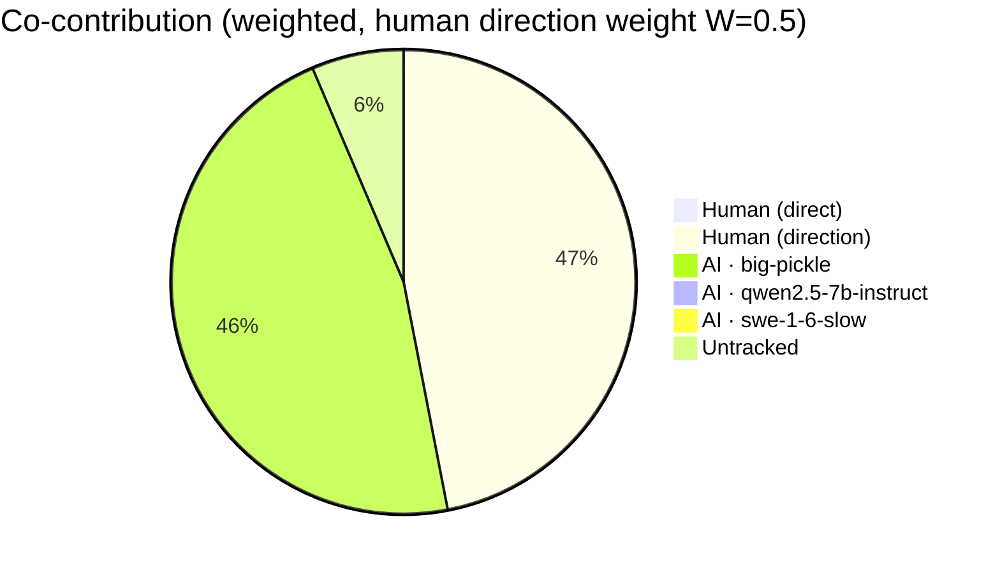
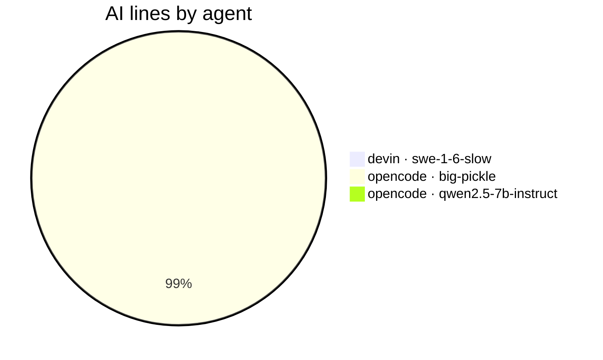
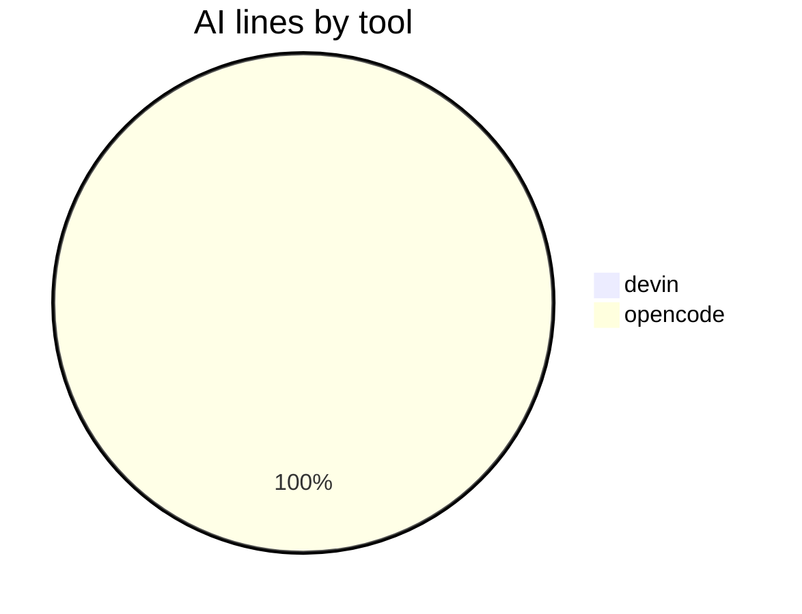
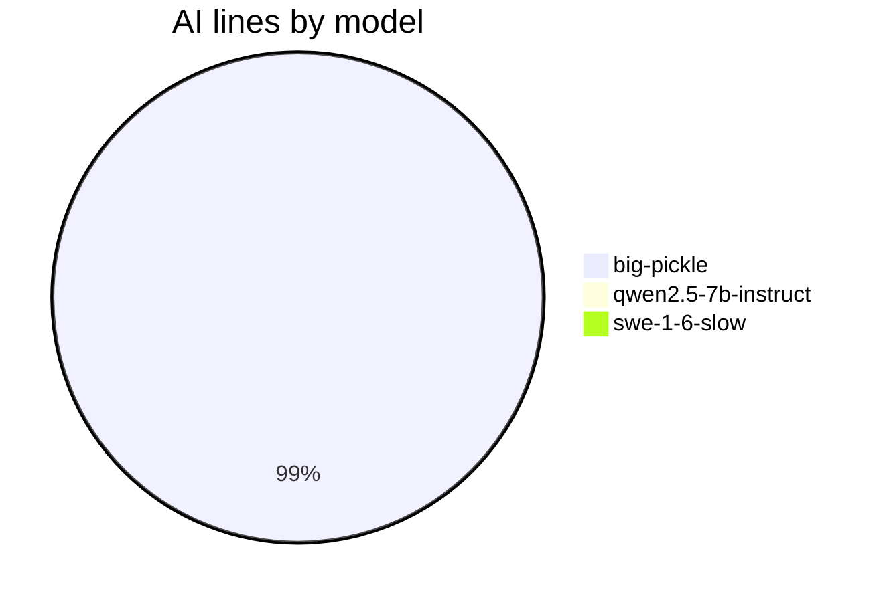
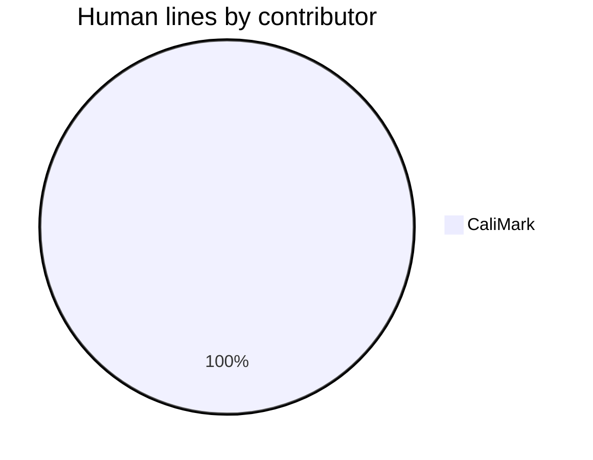

# AI Authorship Report

This file shows which AI coding agent (or human) wrote the code in each commit,
using the [git-ai](https://usegitai.com) attribution notes attached to every
commit. It is regenerated automatically by a GitHub Actions workflow on every
push to `main`.

## Summary

- Commits analyzed: **50** (last 50)
- Total lines added: **4202**
- **AI-generated:** 586 lines (13.9%)
- **Human:** 1 lines (0.2% of project)
- **Bot:** 3575 lines (85.1%) — excluded from pie
- **Untracked:** 40 lines (1.0%)
- **Human-directed AI:** 586 lines (weighted credit: 293 lines at W=0.5, 50.1% of project)
- **Agent-suggested ideas:** 0 AI lines (0.0% of AI; idea weight 0.3) — credit to human: 293 lines; credit to agent: 0 lines
- **Co-authored commits (human + AI lines):** 0
- **Agents:** devin · swe-1-6-slow (1 lines), opencode · big-pickle (582 lines), opencode · qwen2.5-7b-instruct (3 lines)

## Composition











<details>
<summary>Legend — Human, AI, direction credit, and table markers</summary>

> **Agent format:** `opencode · big-pickle` = agent and the LLM model that
> generated the lines (model is recorded when git-ai can resolve it from the
> agent's session data).
>
> **Pie slices:** `Human (direct)` = human-written lines; `Human (direction)` =
> the credited share of AI lines from sessions whose human driver git-ai
> recorded (weight `W` = `REPORT_HUMAN_DIRECTION_WEIGHT`, default 0.5);
> `Agent (idea)` = lines implementing an idea the agent itself suggested
> earlier (via `Idea-By: agent` commit trailer), credited to the agent rather
> than the human who requested it (weight `I` = `REPORT_IDEA_WEIGHT`, default
> 0.3); `AI` = the AI lines not credited to the human (including autonomous
> AI with no recorded driver).
>
> **Table markers:** `✓` = co-authored commit (contains both human-written
> and AI lines); `A` = commit whose idea the agent originated.
>
> **Other:** `bot` = committed by an automated account (`github-actions[bot]`
> and other `[bot]` accounts) — known authorship, not attributed through
> git-ai. `untracked` = lines with no attribution data — written before
> git-ai was set up or made in the github.com web UI (cannot be retroactively
> attributed). `human` = written directly by a human and recorded via
> `git-ai checkpoint human` or the git-ai extension.
>
> **Config:** these are line-count percentages, not commit counts. The
> composition pie excludes the report's own `bot` commits by default; set
> `REPORT_SHOW_BOT_CHART=1` to include them, or `REPORT_SHOW_DIRECTION=0`
> for a strict AI/Human/Untracked line-count pie. The "AI lines by tool" and
> "AI lines by model" pies break down the AI attribution by the agent tool
> and LLM model that produced the lines. "Human lines by contributor" shows
> human-written lines broken down by the commit author who recorded them (via
> `git-ai checkpoint human`).

</details>

## Per-commit breakdown

| Commit | Date | Message | Lines | AI | Human | Co | Idea | Agent(s) |
| --- | --- | --- | --- | --- | --- | --- | --- | --- |
| 16baa7b | 2026-08-17 | sync: update authorship report script + workflow from ai-authorship | 2 | 0% | 0% |  |  | untracked |
| 77e89f5 | 2026-08-17 | docs: regenerate AI authorship report | 88 | 0% | 0% |  |  | bot |
| ed754b5 | 2026-08-17 | sync: update authorship report script + workflow from ai-authorship | 1 | 0% | 0% |  |  | untracked |
| 2a389b7 | 2026-08-17 | docs: regenerate AI authorship report | 173 | 0% | 0% |  |  | bot |
| 96738d5 | 2026-08-17 | sync: update authorship report script + workflow from ai-authorship | 37 | 0% | 0% |  |  | untracked |
| c401213 | 2026-08-17 | docs: regenerate AI authorship report | 91 | 0% | 0% |  |  | bot |
| 1827d1a | 2026-08-17 | chore: hide agent chart (REPORT_SHOW_AGENT_CHART=0) | 1 | 100% | 0% |  |  | opencode · big-pickle |
| 0feadae | 2026-08-17 | docs: regenerate AI authorship report | 122 | 0% | 0% |  |  | bot |
| b064e18 | 2026-08-16 | chore: sync authorship script (REPORT_SHOW_AGENT_CHART toggle) | 8 | 100% | 0% |  |  | opencode · big-pickle |
| b405462 | 2026-08-17 | docs: regenerate AI authorship report | 124 | 0% | 0% |  |  | bot |
| a89f108 | 2026-08-16 | chore: sync authorship script (Human % matches pie) | 1 | 100% | 0% |  |  | opencode · big-pickle |
| 30051a1 | 2026-08-17 | docs: regenerate AI authorship report | 121 | 0% | 0% |  |  | bot |
| 2094d75 | 2026-08-16 | chore: sync authorship script (pie-matched percentage) | 1 | 100% | 0% |  |  | opencode · big-pickle |
| 8a1c327 | 2026-08-17 | docs: regenerate AI authorship report | 121 | 0% | 0% |  |  | bot |
| a518e99 | 2026-08-16 | chore: sync authorship script (weighted percentage fix) | 1 | 100% | 0% |  |  | opencode · big-pickle |
| 231d684 | 2026-08-17 | docs: regenerate AI authorship report | 120 | 0% | 0% |  |  | bot |
| 587d53b | 2026-08-16 | chore: sync authorship script (weighted credit text fix) | 1 | 100% | 0% |  |  | opencode · big-pickle |
| 4c3973e | 2026-08-17 | docs: regenerate AI authorship report | 130 | 0% | 0% |  |  | bot |
| 5e213ad | 2026-08-16 | sync: human lines by contributor pie from ai-authorship | 12 | 100% | 0% |  |  | opencode · big-pickle |
| 480bd3f | 2026-08-17 | docs: regenerate AI authorship report | 483 | 0% | 0% |  |  | bot |
| 7611865 | 2026-08-16 | sync: tool/model breakdown pies + agent-idea provenance from ai-authorship | 160 | 100% | 0% |  |  | opencode · big-pickle |
| f979a1f | 2026-08-16 | docs: regenerate AI authorship report | 318 | 0% | 0% |  |  | bot |
| 4a2cd6e | 2026-08-16 | sync: weighted co-contribution view (human-direction credit) + co-authored marker from ai-authorship | 125 | 100% | 0% |  |  | opencode · big-pickle |
| cdfa377 | 2026-08-16 | docs: regenerate AI authorship report | 112 | 0% | 0% |  |  | bot |
| d8fcf12 | 2026-08-16 | sync: fix copy-in workflow to commit AI-AUTHORSHIP.json alongside the .md | 5 | 100% | 0% |  |  | opencode · big-pickle |
| 54f5cf4 | 2026-08-16 | docs: regenerate AI authorship report | 41 | 0% | 0% |  |  | bot |
| b865bf1 | 2026-08-16 | chore: regenerate report — initial commit rolled out of 50-commit window | 83 | 100% | 0% |  |  | opencode · big-pickle |
| 6a89530 | 2026-08-16 | docs: regenerate AI authorship report | 56 | 0% | 0% |  |  | bot |
| 1a607b4 | 2026-08-16 | sync: update authorship report script + workflow from ai-authorship | 8 | 100% | 0% |  |  | opencode · big-pickle |
| 6033a7c | 2026-08-16 | docs: regenerate AI authorship report | 103 | 0% | 0% |  |  | bot |
| e2fa8ce | 2026-08-16 | sync: update authorship report script + workflow from ai-authorship | 34 | 100% | 0% |  |  | opencode · big-pickle |
| ee29603 | 2026-08-16 | docs: regenerate AI authorship report | 193 | 0% | 0% |  |  | bot |
| f37f6ab | 2026-08-16 | sync: update authorship report script + workflow from ai-authorship | 37 | 100% | 0% |  |  | opencode · big-pickle |
| 4bc8085 | 2026-08-16 | docs: regenerate AI authorship report | 108 | 0% | 0% |  |  | bot |
| 9a23637 | 2026-08-16 | feat: add per-agent breakdown pie chart to report composition | 12 | 100% | 0% |  |  | opencode · big-pickle |
| 9243d1b | 2026-08-16 | docs: regenerate AI authorship report | 757 | 0% | 0% |  |  | bot |
| 3cd6dab | 2026-08-16 | feat: emit machine-readable AI-AUTHORSHIP.json + composition pie chart | 89 | 100% | 0% |  |  | opencode · big-pickle |
| 243887d | 2026-08-16 | docs: regenerate AI authorship report | 52 | 0% | 0% |  |  | bot |
| e7a7c91 | 2026-08-15 | docs: note local-model (LM Studio qwen2.5-7b-instruct) proof on this repo | 2 | 100% | 0% |  |  | opencode · big-pickle |
| 2c9790a | 2026-08-15 | docs: regenerate AI authorship report | 52 | 0% | 0% |  |  | bot |
| 7b79bd1 | 2026-08-15 | Created by LM Stuido with opencode | 3 | 100% | 0% |  |  | opencode · qwen2.5-7b-instruct |
| b79a733 | 2026-08-15 | docs: regenerate AI authorship report | 52 | 0% | 0% |  |  | bot |
| d8ae5d6 | 2026-08-14 | docs: add live website link (needpc.net/life) | 2 | 100% | 0% |  |  | opencode · big-pickle |
| d61a459 | 2026-08-15 | docs: regenerate AI authorship report | 59 | 0% | 0% |  |  | bot |
| 3a4581d | 2026-08-14 | docs: tidy separator before license section | 0 | 0% | 0% |  |  | none |
| 293f451 | 2026-08-14 | docs: remove needpc.net line | 0 | 0% | 0% |  |  | none |
| 8cba1ef | 2026-08-15 | docs: regenerate AI authorship report | 47 | 0% | 0% |  |  | bot |
| b7e37f0 | 2026-08-14 | docs: manually shorten needpc.net line (human-attributed edit) | 1 | 0% | 100% |  |  | human |
| 7195ad1 | 2026-08-15 | docs: regenerate AI authorship report | 52 | 0% | 0% |  |  | bot |
| ca7ee4b | 2026-08-14 | docs: add TeamWork mention via Devin Desktop live test | 1 | 100% | 0% |  |  | devin · swe-1-6-slow |

## Raw git-ai log (last 25 commits)

<details>
<summary>Show raw attribution detail</summary>

```text
commit 16baa7b78496f71696ce3d1131207d688d3c1c79 (HEAD -> main, origin/main)
Author: CaliMark <mreed@needpc.net>
Date:   2026-08-17T14:41:55-07:00

    sync: update authorship report script + workflow from ai-authorship

    Git AI stats:
      you  ········································ ai
           0%           untracked 100%            0%

    Authorship note:
      (none)

commit 77e89f55f497a2e115d027b97a933456f828a98e
Author: github-actions[bot] <41898282+github-actions[bot]@users.noreply.github.com>
Date:   2026-08-17T21:29:34Z

    docs: regenerate AI authorship report

    Git AI stats:
      you  ········································ ai
           0%           untracked 100%            0%

    Authorship note:
      (none)

commit ed754b5e26eb1fbec9878f596e7688c204518729
Author: CaliMark <mreed@needpc.net>
Date:   2026-08-17T14:29:08-07:00

    sync: update authorship report script + workflow from ai-authorship

    Git AI stats:
      you  ········································ ai
           0%           untracked 100%            0%

    Authorship note:
      (none)

commit 2a389b7017f16742dffbcac32b30c927a57071b7
Author: github-actions[bot] <41898282+github-actions[bot]@users.noreply.github.com>
Date:   2026-08-17T21:19:26Z

    docs: regenerate AI authorship report

    Git AI stats:
      you  ········································ ai
           0%           untracked 100%            0%

    Authorship note:
      (none)

commit 96738d5052eb0eb2b4c1b4b796890214435845f6
Author: CaliMark <mreed@needpc.net>
Date:   2026-08-17T14:18:56-07:00

    sync: update authorship report script + workflow from ai-authorship

    Git AI stats:
      you  ········································ ai
           0%           untracked 100%            0%

    Authorship note:
      (none)

commit c40121388031bc1772842855a14549b8114fc4d9
Author: github-actions[bot] <41898282+github-actions[bot]@users.noreply.github.com>
Date:   2026-08-17T07:38:56Z

    docs: regenerate AI authorship report

    Git AI stats:
      you  ········································ ai
           0%           untracked 100%            0%

    Authorship note:
      (none)

commit 1827d1a97e5b7591296d806cbcfb73dc9ce82977
Author: CaliMark <mreed@needpc.net>
Date:   2026-08-17T00:37:55-07:00

    chore: hide agent chart (REPORT_SHOW_AGENT_CHART=0)

    Git AI stats:
      you  ░░░░░░░░░░░░░░░░░░░░░░░░░░░░░░░░░░░░░░░░ ai
           0%                                  100%

    Authorship note:
      .github/workflows/authorship-report.yml
        s_52d0732141ad88::t_d837f309cee14a 45
      ---
      {
        "schema_version": "authorship/3.0.0",
        "git_ai_version": "1.6.22",
        "base_commit_sha": "1827d1a97e5b7591296d806cbcfb73dc9ce82977",
        "prompts": {},
        "sessions": {
          "s_52d0732141ad88": {
            "agent_id": {
              "tool": "opencode",
              "id": "ses_008f7fcbaffeQRUMaWQo3qCxm4",
              "model": "big-pickle"
            },
            "human_author": "CaliMark <mreed@needpc.net>"
          }
        }
      }

commit 0feadae710905ad931eefa1d09179ea107a2e999
Author: github-actions[bot] <41898282+github-actions[bot]@users.noreply.github.com>
Date:   2026-08-17T06:37:57Z

    docs: regenerate AI authorship report

    Git AI stats:
      you  ········································ ai
           0%           untracked 100%            0%

    Authorship note:
      (none)

commit b064e18c2ed565701ad047e0008d6b5f4cc327a6
Author: CaliMark <mreed@needpc.net>
Date:   2026-08-16T23:36:56-07:00

    chore: sync authorship script (REPORT_SHOW_AGENT_CHART toggle)

    Git AI stats:
      you  ░░░░░░░░░░░░░░░░░░░░░░░░░░░░░░░░░░░░░░░░ ai
           0%                                  100%

    Authorship note:
      .github/workflows/authorship-report.yml
        s_988aa8c761b089::t_710edbf2485ccb 43-45
      scripts/authorship-report.sh
        s_988aa8c761b089::t_e4384f8bf27929 98-101,364
      ---
      {
        "schema_version": "authorship/3.0.0",
        "git_ai_version": "1.6.22",
        "base_commit_sha": "b064e18c2ed565701ad047e0008d6b5f4cc327a6",
        "prompts": {},
        "sessions": {
          "s_988aa8c761b089": {
            "agent_id": {
              "tool": "opencode",
              "id": "ses_00bd75ff9ffesJ1tSH9l7XQdiY",
              "model": "big-pickle"
            },
            "human_author": "CaliMark <mreed@needpc.net>"
          }
        }
      }

commit b4054623dd984cdeced034e154fddd6f6d8ea886
Author: github-actions[bot] <41898282+github-actions[bot]@users.noreply.github.com>
Date:   2026-08-17T05:36:34Z

    docs: regenerate AI authorship report

    Git AI stats:
      you  ········································ ai
           0%           untracked 100%            0%

    Authorship note:
      (none)

commit a89f108473cb56f7ee41f8a46798be432f25c08c
Author: CaliMark <mreed@needpc.net>
Date:   2026-08-16T22:35:47-07:00

    chore: sync authorship script (Human % matches pie)

    Git AI stats:
      you  ░░░░░░░░░░░░░░░░░░░░░░░░░░░░░░░░░░░░░░░░ ai
           0%                                  100%

    Authorship note:
      scripts/authorship-report.sh
        s_988aa8c761b089::t_ed8e89d4e5441c 427
      ---
      {
        "schema_version": "authorship/3.0.0",
        "git_ai_version": "1.6.22",
        "base_commit_sha": "a89f108473cb56f7ee41f8a46798be432f25c08c",
        "prompts": {},
        "sessions": {
          "s_988aa8c761b089": {
            "agent_id": {
              "tool": "opencode",
              "id": "ses_00bd75ff9ffesJ1tSH9l7XQdiY",
              "model": "big-pickle"
            },
            "human_author": "CaliMark <mreed@needpc.net>"
          }
        }
      }

commit 30051a1afe5db363f39e2a99a9593edcd4266dec
Author: github-actions[bot] <41898282+github-actions[bot]@users.noreply.github.com>
Date:   2026-08-17T05:24:23Z

    docs: regenerate AI authorship report

    Git AI stats:
      you  ········································ ai
           0%           untracked 100%            0%

    Authorship note:
      (none)

commit 2094d75e6986268511b5865c82c97bfab0c4e58b
Author: CaliMark <mreed@needpc.net>
Date:   2026-08-16T22:23:35-07:00

    chore: sync authorship script (pie-matched percentage)

    Git AI stats:
      you  ░░░░░░░░░░░░░░░░░░░░░░░░░░░░░░░░░░░░░░░░ ai
           0%                                  100%

    Authorship note:
      scripts/authorship-report.sh
        s_988aa8c761b089::t_7f62fa8179d9e5 430
      ---
      {
        "schema_version": "authorship/3.0.0",
        "git_ai_version": "1.6.22",
        "base_commit_sha": "2094d75e6986268511b5865c82c97bfab0c4e58b",
        "prompts": {},
        "sessions": {
          "s_988aa8c761b089": {
            "agent_id": {
              "tool": "opencode",
              "id": "ses_00bd75ff9ffesJ1tSH9l7XQdiY",
              "model": "big-pickle"
            },
            "human_author": "CaliMark <mreed@needpc.net>"
          }
        }
      }

commit 8a1c3273ac2ceda0e4533c5c112627e15bd0b234
Author: github-actions[bot] <41898282+github-actions[bot]@users.noreply.github.com>
Date:   2026-08-17T05:08:38Z

    docs: regenerate AI authorship report

    Git AI stats:
      you  ········································ ai
           0%           untracked 100%            0%

    Authorship note:
      (none)

commit a518e9901e348058aee59b4bdc000069976be1af
Author: CaliMark <mreed@needpc.net>
Date:   2026-08-16T22:07:55-07:00

    chore: sync authorship script (weighted percentage fix)

    Git AI stats:
      you  ░░░░░░░░░░░░░░░░░░░░░░░░░░░░░░░░░░░░░░░░ ai
           0%                                  100%

    Authorship note:
      scripts/authorship-report.sh
        s_988aa8c761b089::t_176c2d0b9d72f5 430
      ---
      {
        "schema_version": "authorship/3.0.0",
        "git_ai_version": "1.6.22",
        "base_commit_sha": "a518e9901e348058aee59b4bdc000069976be1af",
        "prompts": {},
        "sessions": {
          "s_988aa8c761b089": {
            "agent_id": {
              "tool": "opencode",
              "id": "ses_00bd75ff9ffesJ1tSH9l7XQdiY",
              "model": "big-pickle"
            },
            "human_author": "CaliMark <mreed@needpc.net>"
          }
        }
      }

commit 231d684bb85b2afe83fa8a638d213cca1579c6eb
Author: github-actions[bot] <41898282+github-actions[bot]@users.noreply.github.com>
Date:   2026-08-17T04:58:45Z

    docs: regenerate AI authorship report

    Git AI stats:
      you  ········································ ai
           0%           untracked 100%            0%

    Authorship note:
      (none)

commit 587d53bb039f3f2149732a7af0615e07f7de1144
Author: CaliMark <mreed@needpc.net>
Date:   2026-08-16T21:58:03-07:00

    chore: sync authorship script (weighted credit text fix)

    Git AI stats:
      you  ░░░░░░░░░░░░░░░░░░░░░░░░░░░░░░░░░░░░░░░░ ai
           0%                                  100%

    Authorship note:
      scripts/authorship-report.sh
        s_988aa8c761b089::t_e84bc6c98a4b3c 430
      ---
      {
        "schema_version": "authorship/3.0.0",
        "git_ai_version": "1.6.22",
        "base_commit_sha": "587d53bb039f3f2149732a7af0615e07f7de1144",
        "prompts": {},
        "sessions": {
          "s_988aa8c761b089": {
            "agent_id": {
              "tool": "opencode",
              "id": "ses_00bd75ff9ffesJ1tSH9l7XQdiY",
              "model": "big-pickle"
            },
            "human_author": "CaliMark <mreed@needpc.net>"
          }
        }
      }

commit 4c3973e09028619c536315752f6b523df742d017
Author: github-actions[bot] <41898282+github-actions[bot]@users.noreply.github.com>
Date:   2026-08-17T01:58:57Z

    docs: regenerate AI authorship report

    Git AI stats:
      you  ········································ ai
           0%           untracked 100%            0%

    Authorship note:
      (none)

commit 5e213ad36392097823d2126716da246876874487
Author: CaliMark <mreed@needpc.net>
Date:   2026-08-16T18:58:28-07:00

    sync: human lines by contributor pie from ai-authorship

    Git AI stats:
      you  ░░░░░░░░░░░░░░░░░░░░░░░░░░░░░░░░░░░░░░░░ ai
           0%                                  100%

    Authorship note:
      scripts/authorship-report.sh
        s_52d0732141ad88::t_0c661d97d72b06 260-266,363,445-446,469-470
      ---
      {
        "schema_version": "authorship/3.0.0",
        "git_ai_version": "1.6.22",
        "base_commit_sha": "5e213ad36392097823d2126716da246876874487",
        "prompts": {},
        "sessions": {
          "s_52d0732141ad88": {
            "agent_id": {
              "tool": "opencode",
              "id": "ses_008f7fcbaffeQRUMaWQo3qCxm4",
              "model": "big-pickle"
            },
            "human_author": "CaliMark <mreed@needpc.net>"
          }
        }
      }

commit 480bd3f8c7d0af078938fbffe1cf799bef651f54
Author: github-actions[bot] <41898282+github-actions[bot]@users.noreply.github.com>
Date:   2026-08-17T01:12:41Z

    docs: regenerate AI authorship report

    Git AI stats:
      you  ········································ ai
           0%           untracked 100%            0%

    Authorship note:
      (none)

commit 7611865bc2ad619035c975f164cb20fef2eb229c
Author: CaliMark <mreed@needpc.net>
Date:   2026-08-16T18:12:09-07:00

    sync: tool/model breakdown pies + agent-idea provenance from ai-authorship

    Git AI stats:
      you  ░░░░░░░░░░░░░░░░░░░░░░░░░░░░░░░░░░░░░░░░ ai
           0%                                  100%

    Authorship note:
      .github/workflows/authorship-report.yml
        s_988aa8c761b089::t_d9298cfad1df7b 37-42
      scripts/authorship-report.sh
        s_988aa8c761b089::t_ab7357c0f6406a 80-97,99,107-108,110-111,122,188-224,226-228,242-244,246,249,251-258,261-262,265,270-272,307,309-319,323,338,345-346,349,353-356,364-367,370,372-386,423,431-435,447-459,463-464,487,506-510,512-514
      ---
      {
        "schema_version": "authorship/3.0.0",
        "git_ai_version": "1.6.22",
        "base_commit_sha": "7611865bc2ad619035c975f164cb20fef2eb229c",
        "prompts": {},
        "sessions": {
          "s_988aa8c761b089": {
            "agent_id": {
              "tool": "opencode",
              "id": "ses_00bd75ff9ffesJ1tSH9l7XQdiY",
              "model": "big-pickle"
            },
            "human_author": "CaliMark <mreed@needpc.net>"
          }
        }
      }

commit f979a1f97b90da57c58920dee67f6c30809dfbda
Author: github-actions[bot] <41898282+github-actions[bot]@users.noreply.github.com>
Date:   2026-08-16T20:47:59Z

    docs: regenerate AI authorship report

    Git AI stats:
      you  ········································ ai
           0%           untracked 100%            0%

    Authorship note:
      (none)

commit 4a2cd6e3fced29e1899d87761d445fd225308691
Author: CaliMark <mreed@needpc.net>
Date:   2026-08-16T13:47:31-07:00

    sync: weighted co-contribution view (human-direction credit) + co-authored marker from ai-authorship

    Git AI stats:
      you  ░░░░░░░░░░░░░░░░░░░░░░░░░░░░░░░░░░░░░░░░ ai
           0%                                  100%

    Authorship note:
      .github/workflows/authorship-report.yml
        s_988aa8c761b089::t_fb37ea4c2df588 32-36
      scripts/authorship-report.sh
        s_988aa8c761b089::t_4e293999ba2885 38-41,43,45,49,58,67-79,81,105-146,167-175,237-238,240-242,245,255-257,269-285,317-318,334-343,347-348,371,385-390
      ---
      {
        "schema_version": "authorship/3.0.0",
        "git_ai_version": "1.6.22",
        "base_commit_sha": "4a2cd6e3fced29e1899d87761d445fd225308691",
        "prompts": {},
        "sessions": {
          "s_988aa8c761b089": {
            "agent_id": {
              "tool": "opencode",
              "id": "ses_00bd75ff9ffesJ1tSH9l7XQdiY",
              "model": "big-pickle"
            },
            "human_author": "CaliMark <mreed@needpc.net>"
          }
        }
      }

commit cdfa377c800722f79e18b8e21560eb5e5195e407
Author: github-actions[bot] <41898282+github-actions[bot]@users.noreply.github.com>
Date:   2026-08-16T20:00:15Z

    docs: regenerate AI authorship report

    Git AI stats:
      you  ········································ ai
           0%           untracked 100%            0%

    Authorship note:
      (none)

commit d8fcf128f16ea9cb5778792ca0a8ae9f0801f452
Author: CaliMark <mreed@needpc.net>
Date:   2026-08-16T12:59:46-07:00

    sync: fix copy-in workflow to commit AI-AUTHORSHIP.json alongside the .md

    Git AI stats:
      you  ░░░░░░░░░░░░░░░░░░░░░░░░░░░░░░░░░░░░░░░░ ai
           0%                                  100%

    Authorship note:
      .github/workflows/authorship-report.yml
        s_988aa8c761b089::t_1863205ea494a2 60,69-70,72,77
      ---
      {
        "schema_version": "authorship/3.0.0",
        "git_ai_version": "1.6.22",
        "base_commit_sha": "d8fcf128f16ea9cb5778792ca0a8ae9f0801f452",
        "prompts": {},
        "sessions": {
          "s_988aa8c761b089": {
            "agent_id": {
              "tool": "opencode",
              "id": "ses_00bd75ff9ffesJ1tSH9l7XQdiY",
              "model": "big-pickle"
            },
            "human_author": "CaliMark <mreed@needpc.net>"
          }
        }
      }


```
</details>

---

_Generated by [git-ai](https://usegitai.com). See `git ai blame <file>` for
line-level attribution of any file._
